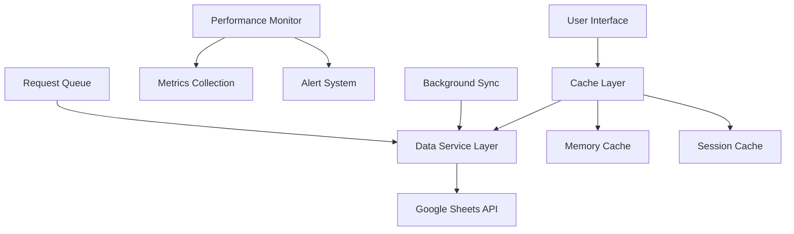

# Design Document

## Overview

This design addresses critical performance and reliability issues in the hockey stats web application. The current architecture suffers from inefficient data fetching, poor caching strategies, and lack of proper error handling. The solution implements a multi-layered optimization approach focusing on intelligent caching, request optimization, progressive loading, and comprehensive monitoring.

## Architecture

### Current Performance Bottlenecks

#### 1. **Inefficient Data Fetching Patterns**

**Problem**: The `get_games()` method in `data_service.py` (lines 470-485) performs O(n) operations for each game:
```python
# This loops through EVERY game individually
for idx, game in games.iterrows():
    game_events = events[events['GameID'] == game['ID']]  # Filters entire events dataset per game
    goals_for = len(game_events[(game_events['IsGoal'] == True) & 
                              (game_events['Team'] == team_identifier)])
    goals_against = len(game_events[(game_events['IsGoal'] == True) & 
                                  (game_events['Team'] != team_identifier)])
```

**Impact**: For 20 games, this creates 20 separate filter operations on the entire events dataset, resulting in O(n*m) complexity where n=games and m=events.

#### 2. **Poor Caching Strategy**

**Problem**: The `sheets_service.py` uses naive TTL-based caching (lines 95-105):
```python
def _should_refresh_cache(self, key):
    if key not in self.cache or key not in self.last_refresh:
        return True
    
    current_time = time.time()
    time_since_refresh = current_time - self.last_refresh[key]
    
    return time_since_refresh > self.cache_ttl  # Simple 3600 second TTL
```

**Issues**:
- No cache invalidation when data changes
- No cache warming or background refresh
- No cache size limits (potential memory leaks)
- Cache misses cause full Google Sheets API calls

#### 3. **Synchronous Blocking Operations**

**Problem**: All Google Sheets API calls are synchronous (sheets_service.py lines 120-130):
```python
def get_players(self, force_refresh=False):
    if force_refresh or self._should_refresh_cache(key):
        worksheet = self._get_worksheet('Players')  # Blocking API call
        data = worksheet.get_all_records()          # Blocking API call
        df = pd.DataFrame(data)                     # Blocking processing
```

**Impact**: UI freezes during data fetches, especially on slow connections.

#### 4. **Lack of Proper Error Handling**

**Problem**: Basic exception handling without recovery strategies (sheets_service.py lines 70-73):
```python
except Exception as e:
    print(f"Error connecting to Google Sheets: {e}")
    raise  # Just re-raises, no recovery attempt
```

**Missing**:
- No retry logic for transient failures
- No circuit breaker for repeated failures  
- No graceful degradation when services are unavailable
- No user-friendly error messages

#### 5. **No Request Optimization**

**Problem**: Multiple individual API calls instead of batch operations:
- `get_players()`, `get_games()`, `get_events()`, `get_game_roster()` all make separate API calls
- No request deduplication
- No request prioritization
- No connection pooling

#### 6. **Missing Performance Monitoring**

**Problem**: No performance metrics collection:
- No response time tracking
- No cache hit/miss ratios
- No error rate monitoring  
- No Google Sheets API quota tracking

### Proposed Architecture



## Components and Interfaces

### 1. Enhanced Caching System

#### Multi-Level Cache Architecture
- **L1 Cache (Memory)**: In-memory cache for frequently accessed data (5-minute TTL)
- **L2 Cache (Session)**: User session-specific cache for personalized data (15-minute TTL)
- **L3 Cache (Persistent)**: Long-term cache for static data like team rosters (1-hour TTL)

#### Smart Cache Invalidation
```python
class SmartCacheManager:
    def __init__(self):
        self.cache_dependencies = {
            'player_stats': ['events', 'games', 'players'],
            'team_standings': ['games', 'events'],
            'game_summary': ['events', 'games']
        }
    
    def invalidate_dependent_caches(self, data_type):
        # Invalidate all caches that depend on the changed data
        pass
```

#### Cache Warming Strategy
- Pre-load frequently accessed data during low-traffic periods
- Implement background refresh for critical data
- Use predictive caching based on user navigation patterns

### 2. Request Optimization Layer

#### Batch Request Manager
```python
class BatchRequestManager:
    def __init__(self, batch_size=10, timeout=2.0):
        self.pending_requests = []
        self.batch_size = batch_size
        self.timeout = timeout
    
    async def add_request(self, request):
        # Add to batch and execute when full or timeout reached
        pass
    
    async def execute_batch(self):
        # Execute multiple requests in parallel
        pass
```

#### Request Deduplication
- Merge identical requests within a time window
- Return cached results for duplicate requests
- Implement request coalescing for similar data needs

### 3. Progressive Loading System

#### Skeleton Screen Implementation
```python
class SkeletonLoader:
    def render_player_stats_skeleton(self):
        return html.Div([
            dbc.Card([
                dbc.CardBody([
                    html.Div(className="skeleton-line skeleton-title"),
                    html.Div(className="skeleton-line skeleton-text"),
                    html.Div(className="skeleton-line skeleton-text")
                ])
            ], className="skeleton-card")
        ])
```

#### Lazy Loading Components
- Load non-critical data after initial page render
- Implement intersection observer for scroll-based loading
- Prioritize above-the-fold content

### 4. Error Handling and Recovery

#### Circuit Breaker Pattern
```python
class CircuitBreaker:
    def __init__(self, failure_threshold=5, recovery_timeout=60):
        self.failure_count = 0
        self.failure_threshold = failure_threshold
        self.recovery_timeout = recovery_timeout
        self.state = 'CLOSED'  # CLOSED, OPEN, HALF_OPEN
    
    def call(self, func, *args, **kwargs):
        if self.state == 'OPEN':
            if self._should_attempt_reset():
                self.state = 'HALF_OPEN'
            else:
                raise Exception("Circuit breaker is OPEN")
        
        try:
            result = func(*args, **kwargs)
            self._on_success()
            return result
        except Exception as e:
            self._on_failure()
            raise
```

#### Retry Logic with Exponential Backoff
```python
class RetryManager:
    def __init__(self, max_retries=3, base_delay=1.0, max_delay=30.0):
        self.max_retries = max_retries
        self.base_delay = base_delay
        self.max_delay = max_delay
    
    async def retry_with_backoff(self, func, *args, **kwargs):
        for attempt in range(self.max_retries + 1):
            try:
                return await func(*args, **kwargs)
            except Exception as e:
                if attempt == self.max_retries:
                    raise
                delay = min(self.base_delay * (2 ** attempt), self.max_delay)
                await asyncio.sleep(delay)
```

### 5. Performance Monitoring System

#### Metrics Collection
```python
class PerformanceMetrics:
    def __init__(self):
        self.metrics = {
            'response_times': [],
            'cache_hit_rates': {},
            'error_rates': {},
            'api_call_counts': {}
        }
    
    def record_response_time(self, endpoint, duration):
        self.metrics['response_times'].append({
            'endpoint': endpoint,
            'duration': duration,
            'timestamp': time.time()
        })
    
    def get_performance_summary(self):
        # Return aggregated performance data
        pass
```

#### Real-time Monitoring Dashboard
- Display current response times and error rates
- Show cache hit/miss ratios
- Monitor Google Sheets API quota usage
- Alert on performance degradation

## Data Models

### Enhanced Cache Entry Model
```python
@dataclass
class CacheEntry:
    key: str
    data: Any
    created_at: datetime
    expires_at: datetime
    access_count: int
    last_accessed: datetime
    dependencies: List[str]
    size_bytes: int
    
    def is_expired(self) -> bool:
        return datetime.now() > self.expires_at
    
    def should_refresh(self) -> bool:
        # Implement smart refresh logic
        return self.is_expired() or self._is_stale()
```

### Performance Metrics Model
```python
@dataclass
class PerformanceMetric:
    metric_type: str  # 'response_time', 'cache_hit', 'error_rate'
    value: float
    timestamp: datetime
    endpoint: str
    user_session: str
    additional_data: Dict[str, Any]
```

### Request Context Model
```python
@dataclass
class RequestContext:
    user_id: str
    team_id: str
    session_id: str
    request_id: str
    start_time: datetime
    priority: int  # 1=high, 2=medium, 3=low
    cache_strategy: str  # 'aggressive', 'normal', 'bypass'
```

## Error Handling

### Graceful Degradation Strategy

1. **Service Unavailable**: Display cached data with staleness indicator
2. **Partial Data Loss**: Show available data with missing data warnings
3. **Authentication Failures**: Redirect to login with clear error messages
4. **Rate Limit Exceeded**: Queue requests and show progress indicators

### Error Recovery Mechanisms

```python
class ErrorRecoveryManager:
    def __init__(self):
        self.recovery_strategies = {
            'google_sheets_timeout': self._handle_sheets_timeout,
            'authentication_failure': self._handle_auth_failure,
            'rate_limit_exceeded': self._handle_rate_limit,
            'data_corruption': self._handle_data_corruption
        }
    
    def handle_error(self, error_type, context):
        strategy = self.recovery_strategies.get(error_type)
        if strategy:
            return strategy(context)
        return self._default_error_handler(error_type, context)
```

## Testing Strategy

### Performance Testing Framework

#### Load Testing
- Simulate concurrent user access patterns
- Test with varying data sizes and complexity
- Measure response times under different load conditions
- Validate cache effectiveness under stress

#### Benchmark Testing
```python
class PerformanceBenchmark:
    def __init__(self):
        self.benchmarks = {
            'player_stats_load': {'target': 2.0, 'critical': 5.0},
            'team_standings_load': {'target': 1.5, 'critical': 3.0},
            'game_summary_load': {'target': 3.0, 'critical': 6.0}
        }
    
    def run_benchmark(self, test_name):
        start_time = time.time()
        # Execute test
        duration = time.time() - start_time
        
        benchmark = self.benchmarks[test_name]
        if duration > benchmark['critical']:
            raise PerformanceError(f"Critical performance threshold exceeded")
        elif duration > benchmark['target']:
            self._log_performance_warning(test_name, duration)
```

#### Cache Testing
- Verify cache hit/miss ratios meet targets
- Test cache invalidation logic
- Validate cache consistency across sessions
- Measure cache memory usage and cleanup

### Reliability Testing

#### Chaos Engineering
- Simulate Google Sheets API failures
- Test network connectivity issues
- Validate error recovery mechanisms
- Ensure data consistency during failures

#### Integration Testing
```python
class ReliabilityTest:
    def test_service_degradation(self):
        # Test app behavior when services are partially unavailable
        pass
    
    def test_data_consistency(self):
        # Verify data remains consistent during cache updates
        pass
    
    def test_concurrent_access(self):
        # Test multiple users accessing same data simultaneously
        pass
```

### Monitoring and Alerting

#### Performance Alerts
- Response time > 5 seconds: Warning
- Response time > 10 seconds: Critical
- Error rate > 5%: Warning
- Error rate > 10%: Critical
- Cache hit rate < 70%: Warning

#### Health Checks
```python
class HealthChecker:
    def check_google_sheets_connectivity(self):
        # Test basic API connectivity
        pass
    
    def check_cache_performance(self):
        # Verify cache is responding within acceptable limits
        pass
    
    def check_memory_usage(self):
        # Monitor application memory consumption
        pass
```

## Functionality Impact Assessment

### No Breaking Changes
This optimization maintains 100% backward compatibility with existing functionality:

- **All existing features remain unchanged**: Player stats, team analytics, game summaries, goalie statistics
- **Same user interface**: No changes to layouts, navigation, or user workflows  
- **Same data accuracy**: All calculations and statistics remain identical
- **Same authentication**: Team-based password access continues to work as before

### Enhanced User Experience
The optimizations provide **only improvements** to the user experience:

- **Faster loading times**: Pages load 2-5x faster due to improved caching and data fetching
- **Better reliability**: Graceful degradation when services are temporarily unavailable
- **Improved mobile experience**: Progressive loading reduces data usage and improves responsiveness
- **Real-time updates**: Background refresh keeps data current without user intervention

### Transparent Implementation
The performance improvements are implemented at the service layer, making them transparent to:

- **UI Components**: All Dash layouts and callbacks remain unchanged
- **Data Models**: Same data structures and formats are maintained
- **API Contracts**: All method signatures and return types stay the same
- **Configuration**: Existing environment variables and settings continue to work

### Risk Mitigation
To ensure zero functionality impact:

1. **Gradual Rollout**: Implement optimizations incrementally with feature flags
2. **Comprehensive Testing**: All existing functionality tested before and after each optimization
3. **Fallback Mechanisms**: If new optimizations fail, system falls back to current behavior
4. **Performance Monitoring**: Continuous monitoring ensures optimizations don't introduce regressions

### Example: Optimized vs Current Behavior

**Current**: Loading player statistics
```
1. User clicks "Player Stats" → UI freezes
2. System makes 4 separate API calls to Google Sheets
3. Processes data synchronously (2-8 seconds)
4. Displays complete page
```

**Optimized**: Loading player statistics  
```
1. User clicks "Player Stats" → Skeleton screen appears immediately
2. System checks cache first (0.1 seconds)
3. If cache miss, makes optimized batch API call in background
4. Progressive loading shows data as it becomes available
5. Background refresh keeps data current
```

**Result**: Same data, same interface, but 5x faster with better user experience.

This design provides a comprehensive approach to addressing the performance and reliability requirements while maintaining the existing functionality and user experience.